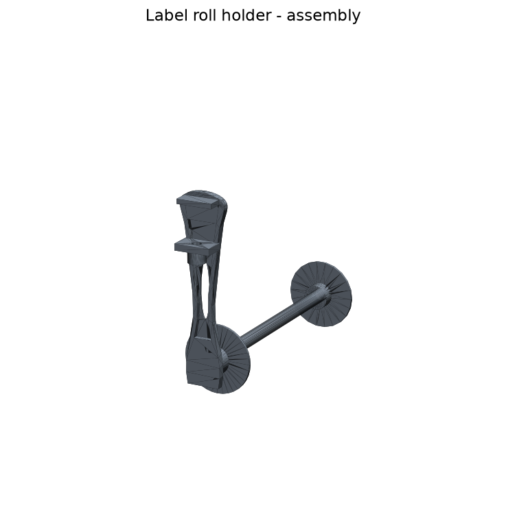

# Label roll holder (3D-printable)

A compact, desk-side-mounted holder for **3 label rolls**, generated as a
fully parametric CAD model. Re-running the build regenerates every printable
file (`STL`) and editable CAD file (`STEP`).



## Specification

| Requirement | Value |
|---|---|
| Number of rolls | 3 |
| Max roll width | 50 mm each |
| Roll core inner diameter (втулка) | 50–80 mm |
| Mounting | Flat plate against the desk side wall, 2 countersunk screws |
| Spindle | Ø30 mm (rolls spin freely on it) |
| Overall reach from wall | ≈ 194 mm |

Because Ø30 mm is smaller than the smallest core (50 mm), every roll slides on
and spins freely. The **separator discs** and the **end-cap flange** are Ø86–88 mm
— larger than the biggest core (80 mm) — so no roll can ride over a stop and
fall off.

## Parts (in `output/`)

| Part | Print qty | Notes |
|---|---|---|
| `bracket` | 1 | Back plate + reinforced spindle (single piece) |
| `separator` | 2 | Disc that keeps neighbouring rolls apart |
| `end_cap` | 1 | Spool-end stop; push-fits onto the spindle tip |

Each part is provided as both `.stl` (slice & print) and `.step` (edit in
FreeCAD / Fusion / SolidWorks). `assembly.step` / `assembly.stl` show all
parts positioned together for reference.


## Loading order

1. Screw the `bracket` to the desk side wall (2 wood screws, Ø ≈ 4.5 mm).
2. Slide roll 1 onto the spindle up to the plate.
3. Slide a `separator`, then roll 2, then a `separator`, then roll 3.
4. Push the `end_cap` onto the tip to lock everything in place.

## Regenerating the files

Dependencies are listed in `requirements.txt` (CadQuery + trimesh + matplotlib).

```bash
python3 build.py     # exports STL + STEP for every part, validates watertightness
python3 render.py    # writes preview PNGs into output/
```

`build.py` fails (non-zero exit) if any part is not a watertight, positive-volume
solid — a hard requirement for reliable printing.

## Customising

All dimensions live in the `Params` dataclass in
[`src/label_roll_holder.py`](src/label_roll_holder.py). For example, to support
4 rolls or wider rolls, change `num_rolls` / `roll_width` and re-run `build.py`.

## Recommended print settings

- **Material:** PLA or PETG.
- **Bracket:** print with the back plate flat on the bed (spindle pointing up).
  Use ≥ 4 perimeters and ≥ 30 % infill — the spindle is a loaded cantilever.
- **Separators / end cap:** flat on the bed, 15–20 % infill.
- **Layer height:** 0.2 mm.
