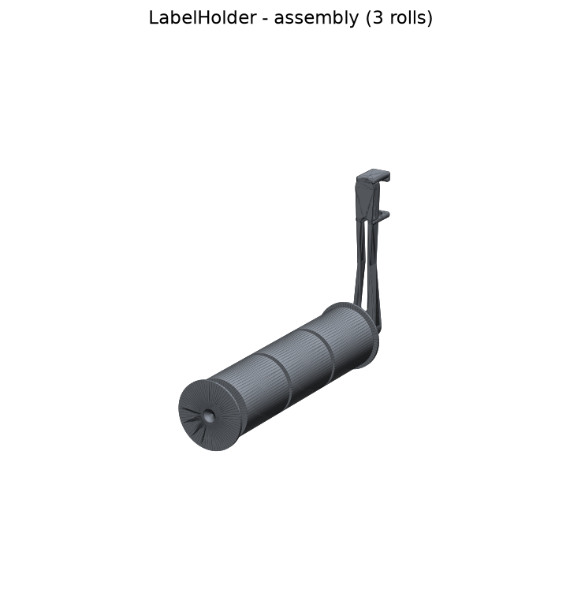

# Label roll holder — 3D-printable, parametric

A slim, industrial-looking desk-edge holder for **3 label rolls**.

Two parametric implementations are provided for the same product:

1. **`LabelHolder.scad`** — OpenSCAD model (primary), exports `STL` + `3MF` +
   `STEP`. See **[OpenSCAD model](#openscad-model-labelholderscad)** below.
2. **`src/label_roll_holder.py`** — CadQuery/Python variant (analytic BREP
   `STEP`), documented in the rest of this file.

---

## OpenSCAD model (`LabelHolder.scad`)

Single central desk-edge clamp, one long Ø16 mm axle, 3 rolls, bayonet
end-lock. Fully parametric (all dimensions at the top of the file), independent
modules `Parameters() / Stand() / Clamp() / Axle() / Lock() / Assembly()`.



### Engineering notes (weak points → fixes)
- **Axle cantilever** dominates deflection: Ø16, 290 mm, 1.5 kg UDL →
  δ=wL⁴/(8EI)≈6.6 mm (PETG) / ≈3.9 mm (PLA). Ø16 & 290 mm are fixed by spec, so
  the joint is a **deep 30 mm hub** (adds no rotation), plus an integral inner
  roll-stop flange; `axle_dia` is a parameter (Ø20 ⇒ −59 % deflection) and PLA /
  100 % infill is recommended for heavy rolls. `Parameters()` echoes the value.
- **Stand bending** (2.2 mm blade is far too soft) → **hidden rear perimeter rib
  (channel section)** adds depth in the load direction; the front stays flat and
  2.2 mm.
- **Clamp spine** locally thickened to full rib depth and blended with large
  radii (no L-bracket).
- Printable without supports (overhangs ≥45°/bridged); recessed screw; bayonet
  for one-hand tool-free removal.

### Parts
| Part | Print qty | Module |
|---|---|---|
| Stand (blade + hidden rib + clamp head + hub) | 1 | `Stand()` |
| Clamp thumb-screw (recessed, self-tapping) | 1 | `Clamp()` |
| Axle Ø16 (inner flange + bayonet ends) | 1 | `Axle()` |
| Bayonet end fixator / roll stop | 2 | `Lock()` |

Files: `output/scad/<part>.stl` (print), `.3mf` (print), `.step` (reference).

### Build / export (OpenSCAD)
Requires system `openscad` + `xvfb` (headless). Preview one part or export all:
```bash
openscad -D 'PART="stand"' -o stand.stl LabelHolder.scad   # single part
./export.sh                                                # all parts -> STL+3MF+STEP
python3 render_scad.py       # preview PNGs
python3 turntable_scad.py    # demo_turntable.mp4
```
`PART` ∈ `assembly | stand | clamp | axle | lock`.

STEP note: OpenSCAD is a mesh modeller, so the `.step` files are **tessellated**
(via OpenCASCADE), not analytic BREP; the screw STEP uses a smooth shaft while
its STL/3MF keep the full printable thread. For an analytic-surface STEP use the
CadQuery variant below.

---

## CadQuery variant (`src/label_roll_holder.py`)

Same product, authored in Python/CadQuery; produces analytic-BREP `STEP`.


## Specification (from the reference)

| Item | Value |
|---|---|
| Rolls | 3, on one axle |
| Roll core inner diameter (втулка) | 50–80 mm |
| Axle (ось) | Ø16 mm, length 286 mm |
| Strut height | 220 mm (56 mm wide at top) |
| Mount | Clamp over the desk edge, desktops 10–40 mm |
| Clamp screw | Printed knurled thumb-screw (tool-free) |
| Axle lock / roll stop | Bayonet fixator (quarter-turn) |

## Parts (in `output/`)

| Part | Print qty | Notes |
|---|---|---|
| `bracket` | 1 | Strut + oval cutout + stiffening rim + edge clamp + axle hub |
| `axle` | 1 | Ø16 mm rod, inner roll-stop flange, bayonet lugs both ends |
| `clamp_screw` | 1 | Knurled thumb-screw, self-taps into the clamp jaw |
| `fixator` | 2 | Bayonet end cap; twist-locks on the axle tip, stops the rolls |

Each part is provided as `.stl` (slice & print) and `.step` (edit in FreeCAD /
Fusion / SolidWorks). `assembly.step` / `assembly.stl` show everything together.


## How it goes together

1. Hook the `bracket` over the desk edge; tighten the `clamp_screw` from below
   against the desktop underside (fits 10–40 mm tops).
2. Slide up to 3 rolls onto the `axle` (they rest against the inner flange).
3. Twist a `fixator` onto the axle tip to retain the rolls.
4. Insert the axle inner end into the bracket hub and twist 90° to lock.

## Regenerating the files

Dependencies are in `requirements.txt` (CadQuery + trimesh + matplotlib).

```bash
python3 build.py     # export STL + STEP for every part; validate watertightness
python3 render.py    # per-part preview PNGs
python3 demo.py      # demo_rolls.png + demo_turntable.mp4 (needs ffmpeg)
```

`build.py` exits non-zero if any part is not a watertight, positive-volume
solid — a hard requirement for reliable printing.

## Customising

All dimensions live in the `Spec` dataclass in
[`src/label_roll_holder.py`](src/label_roll_holder.py). Change `num_rolls`,
`axle_len`, `strut_h`, `desk_gap`, etc. and re-run `build.py`.

## Recommended print settings (per the reference sheet)

- **Material:** PLA or PETG.
- **Layer height:** 0.2 mm, **4 perimeters**, **~35 % gyroid** infill.
- **Bracket:** print on its flat back; no supports needed.
- **Clamp screw / fixator:** flat on the bed.
- **Axle:** print upright if the printer is tall enough, otherwise lay it flat.

## Design notes / interpretation

The reference infographic mixes a few inconsistent numbers (e.g. side-view
"110 mm" vs. axle length 286 mm, and core Ø50–80 vs. roll Ø75). This model
follows the explicit part callouts (axle Ø16 × 286 mm; strut 56 × 220 mm; clamp
10–40 mm) and implements a **cantilever axle** with a bayonet mount + a bayonet
end fixator, which is the most functional and print-friendly reading. The clamp
screw self-taps into a plain pilot hole (robust FDM approach) rather than a
modelled internal thread. Everything is parametric, so any of these choices are
one edit away from changing.
